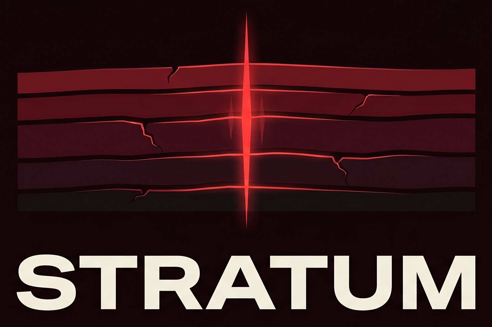
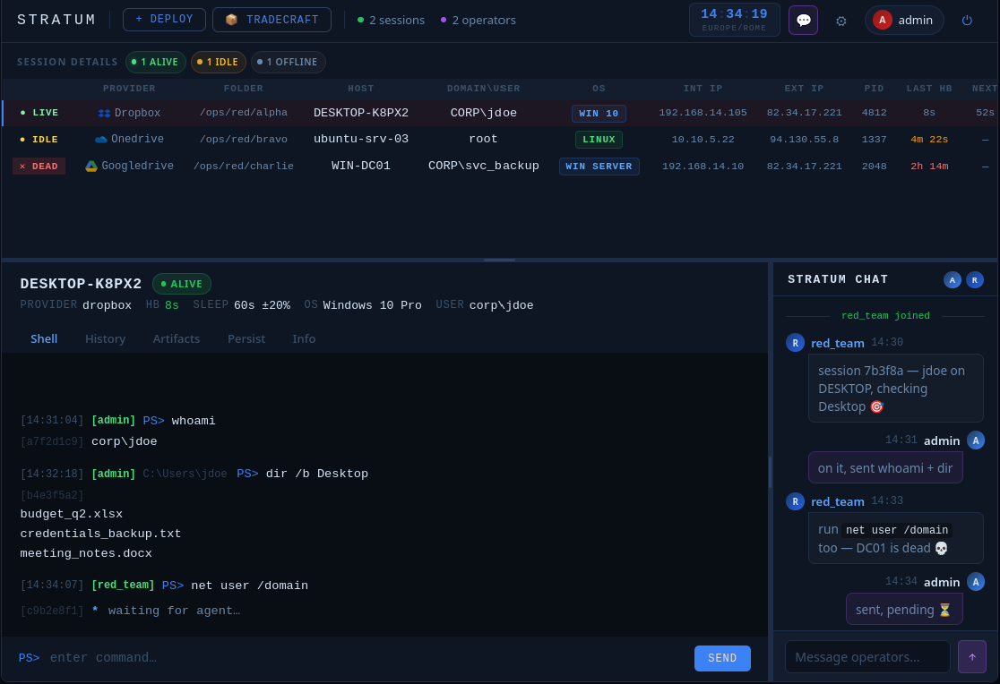
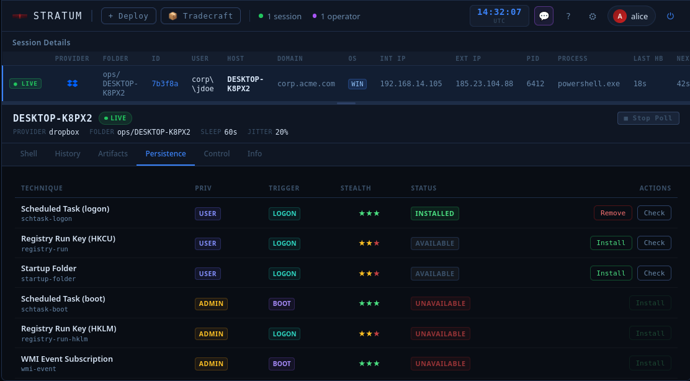
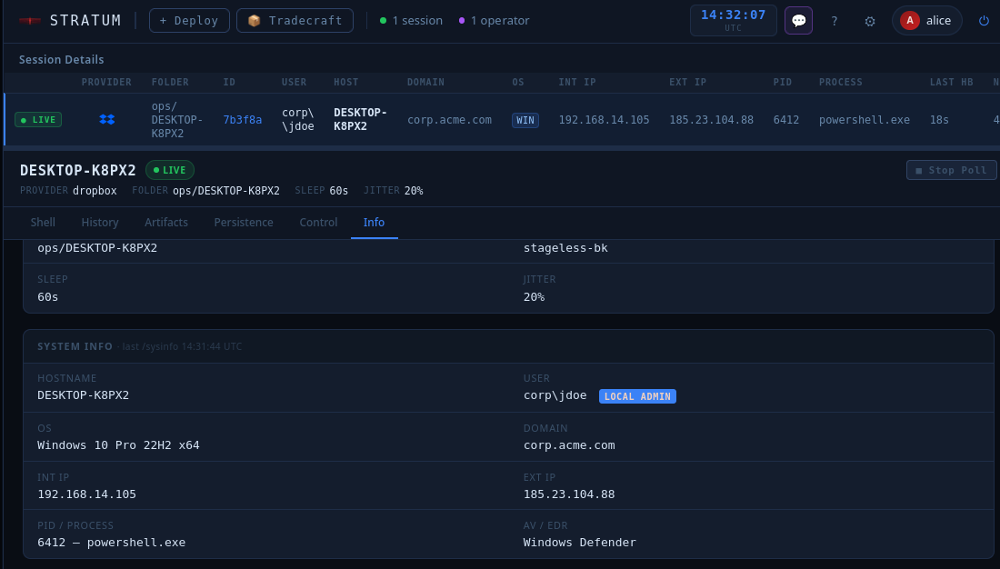

<div align="center">
  
</div>

<div align="center">

**Cloud Persistence Framework · v1.0**

*A fallback foothold that routes through infrastructure defenders can't block.*

[](LICENSE)
[]()

[]()
[]()
[]()
[]()
[]()

</div>

---

## The problem

Your primary C2 goes silent. The domain gets blacklisted. The beacon gets flagged. The EDR kills the process. You're out.

You need a second channel — one that was never going to get blocked in the first place.

---

## The idea

What if command-and-control traffic looked exactly like an employee syncing files to Dropbox?

That's Stratum. Commands and responses travel as ordinary files inside a cloud storage folder. The agent never connects to attacker infrastructure. The only observable traffic is HTTPS to a provider the target's firewall already whitelists — because blocking Dropbox or OneDrive means blocking every employee who uses it.

**No teamserver. No attacker-owned domain. No suspicious TLS certificate. Nothing to block.**

```
  OPERATOR                   CLOUD PROVIDER               TARGET
  ────────                   ─────────────                ──────
                             /Machine1/
  WebGUI ──HTTPS──►          input.txt   🔒  ◄── poll ── agent
                             output.txt  🔒  ──► read ──┘
                             heartbeat.txt    (encrypted beacon)
```

The agent wakes on a configurable interval (+ log-normal jitter), reads the input file, executes, encrypts the response, uploads it, and sleeps. Everything encrypted end-to-end with RSA-4096-OAEP + AES-256-GCM. The operator's IP never appears in any network log on the target side.

<div align="center">
  
</div>

---

## Cloud Providers

<div align="center">

| | Provider | Notes |
|:---:|---|---|
|  | **Dropbox** | OAuth2 refresh token · Business and personal accounts |
|  | **Microsoft OneDrive** | Microsoft Graph API · Personal and M365 accounts |
|  | **Google Drive** | Google Drive API v3 · OAuth2 service flow |
|  | **SharePoint Online** | Microsoft Graph API · M365 tenant sites |
|  | **S3-compatible** | AWS S3 · DigitalOcean Spaces · Backblaze B2 · any S3 endpoint |

</div>

All five share the same wire format, the same RSA keypair, and the same operator session. **Switch provider mid-engagement in minutes without touching the agent.** No other open-source framework ships this out of the box.

---

## Five things that don't exist anywhere else

### 1. The channel is structurally unblockable

A SOC that wants to stop C2 blocks the teamserver domain or fronted infrastructure. A SOC that wants to stop Stratum has to block Dropbox, OneDrive, Google Drive, SharePoint, and S3 simultaneously. That's not a firewall rule — it's a business decision no enterprise is going to make. The dead-drop architecture doesn't try to evade detection. It operates on infrastructure the defender has already decided to trust, permanently.

### 2. Six agent formats from a single deploy flow

| Format | Platform | Dependencies |
|---|---|---|
| `.sh` | Linux | `curl` + `openssl` — pre-installed everywhere |
| `.ps1` | Windows | PowerShell 5.1+ — pre-installed since Windows 7 |
| `.exe` / `.dll` | Windows | None — Rust-compiled PE, no interpreter, no PowerShell in process tree |
| `.elf` | Linux | None — Rust-compiled musl-static, runs on any x86_64 Linux |
| `.bin` | Linux / Windows | x64 PIC shellcode — drop into any external loader or injector |

The wizard generates all of them. You answer prompts; it compiles, signs, encrypts, and packages. No compiler flags, no env vars, no manual key management.

### 3. Three deploy modes — matched to the engagement

| Mode | How it works | Best for |
|---|---|---|
| **staged-enc** | Minimal stub on target. On first run: fetches one-time bootstrap key from cloud, decrypts full agent in memory, deletes key from cloud. Payload never touches disk in cleartext. | Standard engagements — smallest initial artifact, key destroyed on delivery |
| **stageless-enc** | Full agent embedded in single delivery file, encrypted with a stub-baked key. No cloud key fetch needed after delivery. | Air-gapped or restricted networks — single self-contained file |
| **stageless-plain** | Agent in cleartext. Commands and responses remain fully encrypted in transit. | Labs and controlled environments |

All modes share the same post-execution behaviour: the stub caches an HW-fingerprinted encrypted blob locally so subsequent runs load from disk without touching the cloud.

### 4. Persistence — probe, install, survive

Before touching a single registry key or cron entry, run `/persist probe`. The agent checks every available technique at the current privilege level and returns a feasibility report. Non-destructive — no artifacts left behind.

```
/persist probe
  ✓ schtask-logon   — feasible (SYSTEM)
  ✓ registry-run    — feasible
  ✗ schtask-boot    — requires elevation
  ✓ startup-folder  — feasible
  ...
```

Pick what works, install it, remove it cleanly when done. The WebGUI tracks every installed technique per session. `/kill` tears everything down — persistence, binary, cloud artifacts — in one command.

<div align="center">
  
</div>

### 5. Operational guardrails baked at deploy time

Kill date, maintenance window, log-normal jitter, one-time bootstrap key — all configured once in the wizard and compiled into the agent permanently. Nothing to manage during the engagement, nothing to forget to clean up at the end.

---

## How Stratum fits into an engagement

Stratum is not a replacement for Cobalt Strike, Sliver, or Havoc. It's the layer underneath them.

```
  Day 1: deploy Stratum alongside your primary C2
  Day 4: primary beacon gets flagged, process killed
  Day 4: open Stratum session, assess what happened
  Day 4: re-introduce primary C2 via Stratum shell
  Day 5: back to full access
```

Your primary C2 handles post-exploitation. Stratum handles **survival**. It's the channel that was never going to get detected because it was never trying to hide — it just looks like Dropbox.

This is the same paradigm used in the wild by threat actors documented in 2025–2026: TukTuk (Dropbox + Arweave dead-drop), NarwhalRAT/APT37 (pCloud), COBALT MIRAGE/Drokbk (GitHub). Stratum brings the same architecture to the red team side as a proper framework, not a one-off implant.

---

## Quick start

### 1. Install

```bash
git clone https://github.com/daniomass/stratum-c2.git
cd stratum-c2
./install.sh --server
```

### 2. Rust toolchain

Compiled agents (`.exe`, `.elf`, `.dll`, `.bin`, native Rust) are a core feature of Stratum. The wizard detects and uses whatever targets are available, skipping only what it can't build.

```bash
curl --proto '=https' --tlsv1.2 -sSf https://sh.rustup.rs | sh
source "$HOME/.cargo/env"

# Windows PE / DLL
rustup target add x86_64-pc-windows-gnu && sudo apt install mingw-w64

# Linux musl-static ELF
rustup target add x86_64-unknown-linux-musl && sudo apt install musl-tools

# Flat x64 shellcode
rustup target add x86_64-unknown-none && sudo apt install lld
```

### 3. Start and deploy

```bash
python3 stratum-server.py
```

Open `https://<host>:<port>`, log in, click **Deploy**. The wizard walks you through provider credentials, agent format, deploy mode, persistence identity, and guardrails (kill date, window, jitter). At the end it hands you ready-to-run artifacts. Full setup details in the wiki (`docs/wiki.html`).

### 4. Deliver and connect

```bash
# Linux — background, no terminal
nohup ./stub.sh &>/dev/null &

# Windows — hidden window
powershell -NoProfile -WindowStyle Hidden -ExecutionPolicy Bypass -File stub.ps1
```

Session appears in the WebGUI automatically on first beacon.

---

## The WebGUI

Multi-operator, real-time, browser-based. Every operator sees the same sessions live via WebSocket.

```
/sysinfo             — full system profile: hardware, OS, network, AV/EDR, containers
/persist probe       — non-destructive feasibility check, all techniques
/persist install <id>— install a persistence technique
/persist remove <id> — remove a specific technique
/kill                — remove all persistence + wipe artifacts + terminate agent
/download <path>     — pull file from target
/upload <path>       — push file to target
/sleep <s>           — change beacon interval live
/jitter <pct>        — change jitter percentage live
/timestomp <args>    — set file timestamps on target
/exit                — stop agent process (persistence survives)
```

Each session has dedicated tabs: **Shell** · **Info** (live sysinfo panel) · **Artifacts** · **Staging** · **Persist** · **History**. Global views: **Sessions** · **Deploy** · **Archives** · **Tradecraft** · **Settings**.

<div align="center">
  
</div>

---

## Authentication

| Mode | Description |
|---|---|
| `local` | Username/password in `server.yml`. No roles — all operators equal. |
| `oidc-manual` | External OIDC provider (Keycloak, Azure AD, Okta). Whitelist-based access. |
| `oidc-auto` | Any authenticated identity gets access. Blocklist for revocation. |

---

## Crypto

| Layer | Algorithm |
|---|---|
| Key exchange | RSA-4096-OAEP-SHA-256 (per-deployment keypair) |
| Command encryption | AES-256-GCM (session key, pre-shared) |
| Heartbeat encryption | RSA-4096-OAEP-SHA-256 + AES-256-GCM |
| Response signing | RSA-PSS-SHA-256 |
| Blob key derivation | PBKDF2-HMAC-SHA-256 · 210,000 iterations |
| Bootstrap key | One-time-use — deleted from cloud on first agent run |
| Session key in binary | XOR-obfuscated in `.rodata` — raw hex never appears verbatim |
| Local blob encryption | AES-256-GCM (Rust agents) · AES-256-CBC (bash/PS1 stubs) — cross-compatible |

---

## Extending Stratum

Adding a provider is ~360 lines: HTTP transport (`upload` / `download` / `delete` / token refresh) + deployment wizard. Encryption, heartbeat, command dispatch, persistence, timestomping, and artifact tracking come for free from the core. Reference implementation: `providers/dropbox/`.

---

## Documentation

Full technical documentation — cryptographic protocol, wire format, heartbeat internals, transport interface, persistence techniques, OPSEC notes — is in `docs/wiki.html`. Open it locally in a browser.

UI mockups for all screens (session list, shell, persist tab, info tab, deploy wizard, chat) are in `docs/mockups.html` — open locally in a browser to browse every scene.

---

## Legal

**Stratum is intended for educational and authorized security testing purposes only.**

This software is provided for defensive security research, penetration testing training, and authorized security assessments. Users are solely responsible for ensuring their use complies with all applicable laws and regulations.

**For cloud services:** If testing targets hosted on Dropbox, OneDrive, Google Drive, S3, or SharePoint, you must have explicit authorization from both the service provider and the resource owner. Unauthorized access to cloud services is illegal.

**Unauthorized access to computer systems is a criminal offense** and can result in severe civil and criminal penalties, including fines and imprisonment.

By using this software, you acknowledge that you have read this disclaimer and agree to use Stratum only for lawful purposes with proper authorization.

---

<div align="center">

**Built for operators who need infrastructure that isn't there.**

*If Stratum has been useful, consider leaving a ⭐ — it helps others find it.*

</div>
